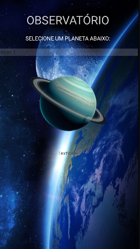

# 🪐 Aplicativo Observatório de Planetas

Um aplicativo móvel educativo desenvolvido nativamente para a plataforma Android. O projeto funciona como um guia interativo do sistema solar, exibindo informações detalhadas, curiosidades e características dos planetas através de uma interface de usuário fluida, imersiva e visualmente atraente.

---

## 🚀 Funcionalidades Principais

* **🌌 Catálogo de Planetas:** Menu de seleção interativo para navegar pelos diferentes corpos celestes.
* **ℹ️ Informações Detalhadas:** Telas dinâmicas que exibem dados astronômicos de forma organizada e limpa.
* **📱 Interface Responsiva (Mobile):** Layout otimizado para diferentes tamanhos de tela e densidades de pixel em smartphones Android.
* **🎨 Design Imersivo:** Uso estratégico de elementos visuais e backgrounds espaciais para enriquecer a experiência do usuário.

---

## 🛠️ Tecnologias Utilizadas

O desenvolvimento seguiu os padrões nativos da plataforma móvel da Google:

* **Ambiente de Desenvolvimento:** Android Studio (IDE oficial).
* **Linguagem de Programação:** Java (Lógica de controle, navegação entre intents e gerenciamento do ciclo de vida das Activities).
* **Interface Gráfica (UI):** XML (Estruturação e estilização das Views, layouts e componentes nativos).

---

## 📦 Como Compilar e Rodar o Projeto

Para testar ou inspecionar o código deste aplicativo, você precisará do **Android Studio** instalado na sua máquina.

### Passos para Configuração:

1. Na página principal deste repositório, clique no botão verde **"Code"** e escolha **"Download ZIP"**.
2. Extraia o conteúdo do arquivo compactado em uma pasta de sua preferência.
3. Abra o **Android Studio**, clique em **File > Open** e selecione a pasta extraída.
4. Aguarde a IDE sincronizar os arquivos do **Gradle** (esse processo pode demorar alguns minutos na primeira execução enquanto baixa as dependências).
5. Para rodar o app:
   * Conecte um smartphone Android físico via cabo USB com a *Depuração USB* ativada, **OU**
   * Utilize um dispositivo virtual (Emulador/AVD) previamente configurado no próprio Android Studio.
6. Clique no botão de "Play" (ícone de triângulo verde) na barra superior para compilar e instalar o app.

---

## 🎨 Demonstração Visual

| Interface de Inicialização do Aplicativo |
| :---: |
|  |
---

# 👨‍💻 Autor

Matheus Araujo da Silva

- Site/Portifólio: https://matheus-araujo.net.br
- GitHub: https://github.com/matheusaraujo019
- LinkedIn: https://www.linkedin.com/in/matheus-araujo-da-silva-9a082b388/

---

# 📄 Licença

Este projeto está sob a licença MIT.

